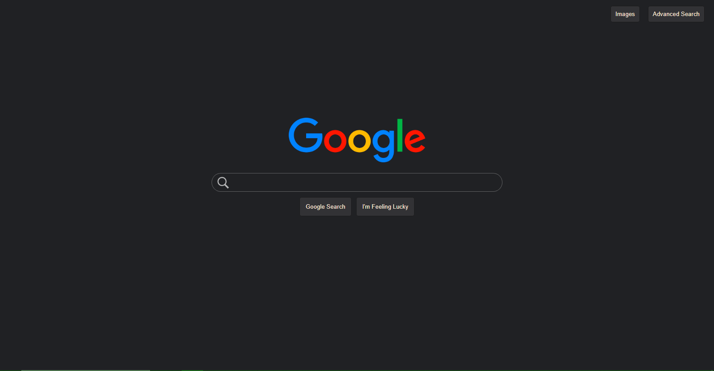
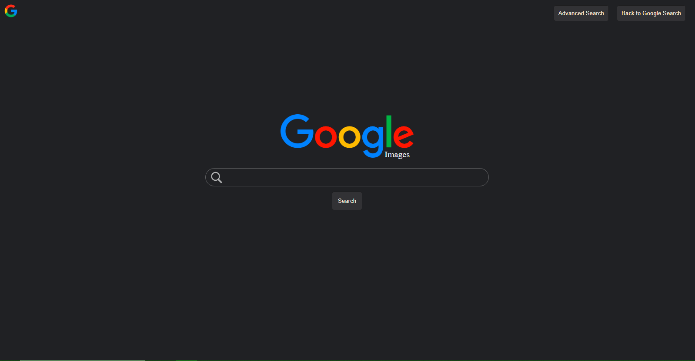
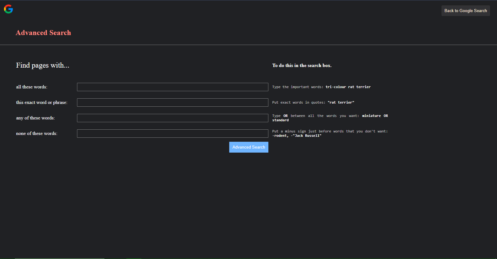

# Google-Search-Clone
Clone of Google search page that works just like google search.

---
__index.html__
- This page imitates the normal google search page. 
- When an input is given on __`search bar`__, it redirects to search results.

  

__imgsearch.html__
- This page imitates the google image search page.
- When an input is give on __`search bar`__, it redirects to google image search results. 

  

__advanced.html__
- This page imitates the google's advanced search page _(first four fields)_.
- Page has four different input fields. When given input on all or some of the input fields, it combines it into a single query and redirects to google advanced search results. 

  

